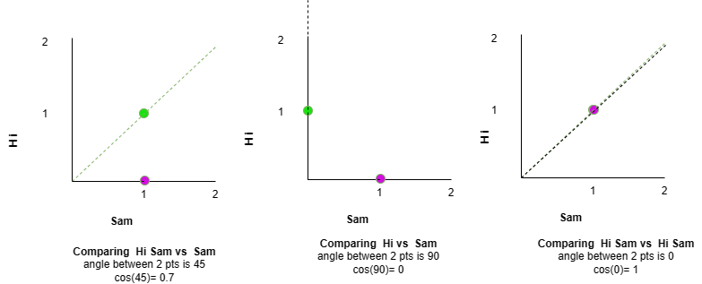
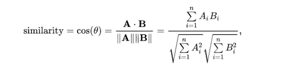

# What is Vector? 
Let's start from the basic

**Vector:** Quantity with a _magnitude_ and a _direction_


**Magnitude** : It's the size of an object, a property which determines whether the object is larger or smaller than other objects of the same kind.

**Direction** : Vectors have a specific direction in space. This direction can be represented by an angle with respect to a reference axis or by specifying the coordinates of the vector's endpoint in a coordinate system.

Representation: Vectors can be represented in various ways,

- Geometrically using arrows
- Using ordered sets of numbers
- Using column matrices

**Vector Arithmetic Operations:**

- **Addition and Subtraction:** Vectors can be added or subtracted component-wise.

    Let's say you have three vectors A, B, and C:
    
    Vector A: [A₁, A₂, A₃]
    
    Vector B: [B₁, B₂, B₃]
    
    Vector C: [C₁, C₂, C₃]
    
    To add these vectors together, you add their corresponding components:
    
    Resultant Vector R: [A₁ + B₁ + C₁, A₂ + B₂ + C₂, A₃ + B₃ + C₃]
    
    Similarly for the subtraction

- **Multiplication:**

    1. **Scalar Multiplication:** Vectors can be multiplied by scalars (real numbers), resulting in a vector with the same direction but a scaled magnitude. Scalar multiplication affects the length of the vector but not its direction.
        
          If you have a vector A and a scalar k:
          
          Vector A: [A₁, A₂, A₃]
          
          Scalar k
          
          The scalar multiplication result is:
          
          k \* A = [k \* A₁, k \* A₂, k \* A₃]
    
    1. **Dot Product (Scalar Product):** The dot product of two vectors is a scalar quantity obtained by multiplying the corresponding components of the vectors and summing the results. It provides a measure of the alignment between two vectors.
    
        If you have two vectors A and B:
        
        Vector A: [A₁, A₂, A₃]
        
        Vector B: [B₁, B₂, B₃]
        
        The dot product is calculated as:
        
        A · B = A₁ \* B₁ + A₂ \* B₂ + A₃ \* B₃
    
    1. **Cross Product (Vector Product):** The cross product of two vectors results in a third vector that is perpendicular to both input vectors. (to Find the momentum)
    
        If you have two vectors A and B:
        
        Vector A: [A₁, A₂, A₃]
        
        Vector B: [B₁, B₂, B₃]
        
        The cross product is calculated as:
        
        A × B = [A₂ \* B₃ - A₃ \* B₂, A₃ \* B₁ - A₁ \* B₃, A₁ \* B₂ - A₂ \* B₁]
    
    1. **Unit Vector:** A unit vector is a vector with a magnitude of 1 that points in a specific direction. It is commonly used to describe directions in space.
       

Now I am sure you might have fair re-collection or understanding of vectors

# Vector Search

Its Similarity based search. here you are going to find the object based on a similarity measure. There are multiple algorithms to find the similarity such as Euclidean distance, cosine similarity, or Jaccard .

In this article lets explore cosine search

**Usecase 1**

Let's start from the basics 

consider we have 2 statements 

1. Hi Sam
2. Sam

| **Title** 	| **Hi** 	| **Sam** 	|
|-----------	|--------	|---------	|
| Hi Sam    	| 1      	| 1       	|
| Sam       	| 0      	| 1       	|

Let's plot it in the graph



**Usecase 2**

lets have three sample sentence

1. AWS PaaS cloud developer

2. Azure PaaS Developer

3. RF Tester

| **Title**                 	| **AWS** 	| **PaaS** 	| **Cloud** 	| **Developer** 	| **Azure** 	| **RF** 	| **Tester** 	|
|---------------------------	|---------	|----------	|-----------	|---------------	|-----------	|--------	|------------	|
| AWS PaaS Cloud Developer  	| 1       	| 1        	| 1         	| 1             	| 0         	| 0      	| 0          	|
| Azure PaaS Developer      	| 0       	| 1        	| 0         	| 1             	| 1         	| 0      	| 0          	|
| RF Tester                 	| 0       	| 0        	| 0         	| 0             	| 0         	| 1      	| 1          	|

Here we need to plot 6-dimensional graph to plot the same.

For this we can make use of the cosine formula as below



let's find the similarity of first 2 statements.

    A . B = ( 1 X 0 ) + ( 1 X 1 ) + ( 1 X 0 ) + ( 1 X 1 ) + ( 0 X 1 ) + ( 0 X 0 ) + (0 X 0)= 2

    ||A|| = sqrt( 1^2 + 1^2 + 1^2 + 1^2 + 0^2 + 0^2 +  0^2 )  = 2

    ||B|| = sqrt( 0^2 + 1^2 + 0^2 + 1^2 + 1^2 + 0^2 + 0^2 ) = 1.73

    Similarity = (A . B) / (||A|| x ||B||) = 2/(2 x 1.73) = 0.57

There are many vector search libraries are available like FAISS, Annoy 

  # Demo
  
  **UseCase**
  Create a Image Search application. Store the multi-dimensional vector in SQLite DB. Use cosine based search to find the similarity 
  
  let's build logic for cosine search
  ```python
       def cosine_similarity(a, b):
            # Ensure that both vectors have the same length
            min_length = min(len(a), len(b))
            a = a[:min_length]
            b = b[:min_length] 
        
            # Calculate dot product and magnitudes 
            # Dot Product (Scalar Product) The dot product of two vectors is a scalar quantity obtained by
            # multiplying the corresponding components of the vectors and summing the results.
            # It provides a measure of the alignment between two vectors.
            
            # If you have two vectors A and B:        
            #     Vector A: [A₁, A₂, A₃]        
            #     Vector B: [B₁, B₂, B₃]        
            #     The dot product is calculated as:        
            #     A · B = A₁ \* B₁ + A₂ \* B₂ + A₃ \* B₃
        
            dot_product = np.dot(a, b)
            magnitude_a = np.linalg.norm(a)
            magnitude_b = np.linalg.norm(b)
        
            # Calculate cosine similarity
        
            if magnitude_a == 0 or magnitude_b == 0:
                return 0.0
            similarity = dot_product / (magnitude_a * magnitude_b)
            return similarity    
  ```
  **Steps**
  - Data preparation 
      1.  Read all the images and convert into  vector using numpy
      2.  Save the flatten array in the database
   ```python
       def load_images():
            # Connect to the database or create a new one
            db_connection = sqlite3.connect("image_database.db")
            cursor = db_connection.cursor()
            cursor.execute("CREATE TABLE IF NOT EXISTS images (id INTEGER PRIMARY KEY, file_name varchar(100), image_data BLOB)")
            folder_path = "./training_images/" 
            file_names = os.listdir(folder_path)
        
            # Read all the images and convert into  vector using numpy
            for file_name in file_names:       
                image_path = f"{folder_path}{file_name}" 
                image = Image.open(image_path)
        
                # Convert the image to grayscale
                gray_image = image.convert('L')
                # gray_image.save(f'gray_{file_name}')
               
                image_vector = np.array(gray_image,dtype=np.float32).flatten()
                cursor.execute("INSERT INTO images (file_name,image_data) VALUES (?,?)",(file_name,image_vector.tobytes()) )
                # break        
        
            db_connection.commit()
            db_connection.close()
  ```
  - Search by Image
      1. Read the Image and convert it into array
      2. Find the matching using dot product and cosine similarity
      3. For More understating on cosine Similarity refer (https://www.machinelearningplus.com/nlp/cosine-similarity/)
   ``` python    
    def find_similar_vectors(query_vector, threshold, database_path):
        conn = sqlite3.connect(database_path)
        cursor = conn.cursor()
    
        cursor.execute("SELECT id,file_name,image_data FROM images")
        similar_vectors = []
    
        for row in cursor.fetchall():
            vector_blob = row[2]      
            # print(vector_blob )
            stored_vector = np.frombuffer(vector_blob, dtype=np.float32)
            
            similarity = cosine_similarity(query_vector, stored_vector)      
            if similarity >= threshold:
                similar_vectors.append((row[0],row[1],similarity))
    
        similar_vectors.sort(key=lambda x: x[2], reverse=True)
        conn.close()
        return similar_vectors
    
    
    image = Image.open("./test_images/ts_find.png")
    query_vector = np.array(image,dtype=np.float32).flatten()
    threshold = 0.9
    database_path = 'image_database.db'
    similar_vectors = find_similar_vectors(query_vector, threshold, database_path)    
    
    for vec_id, file_name,similarity in similar_vectors:
        print(f"Vector ID: {vec_id}, file_name: {file_name}, Similarity: {similarity}")

   ```
# Vector Database

A **vector database** is a type of database that stores and retrieves data using vectors as the fundamental data representation (Data points in a multi-dimensional space).

Each dimension in the space corresponds to a specific feature or attribute of the data.

Vector databases are particularly useful for working with high-dimensional data, such as images, audio, text, and other complex data types.

In this, each data item is represented as a vector of numerical values, where each value corresponds to a feature of the data.

These vectors can then be indexed and queried for various purposes, such as similarity search, clustering, classification, and recommendation systems.

This makes them suitable for applications such as:

- Content-based Retrieval: image and video search
- Natural Language Processing (NLP): Find similar words or sentences based on their semantic meanings.
- Recommendation Systems: For efficient recommendation of items based on similarity to a user's preferences.
- Anomaly Detection: By identifying deviations from normal patterns.
- Vector databases are engineered to perform high-speed similarity searches in massive datasets

    
**Happy Coding!**
